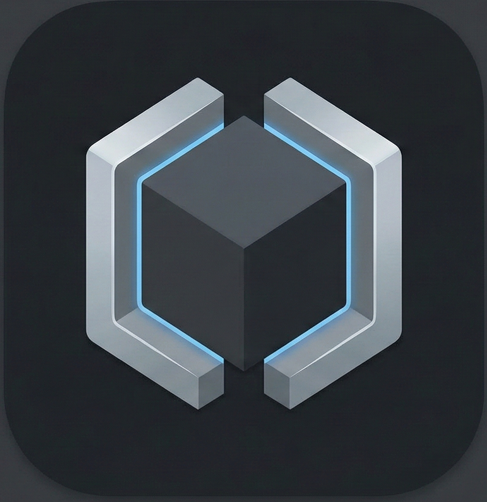

# 🧠 Digital Denis — Personal Cognitive Operating System

<div align="center">



**Твоя персональная цифровая личность для усиления мышления**

[](https://fastapi.tiangolo.com/)
[](https://nextjs.org/)
[](https://www.postgresql.org/)
[](https://telegram.org/)

</div>

---

## 📌 Что это за проект

**Digital Denis** — это персональная когнитивная система (Digital Twin), предназначенная для **усиления мышления конкретного человека**, а не для универсального ассистирования.

Проект решает фундаментальную проблему современных LLM:

- ❌ Отсутствие устойчивой личности
- ❌ Отсутствие управляемой памяти  
- ❌ Деградация контекста во времени
- ❌ Неаудируемые решения

> **Digital Denis — это не чат-бот и не "умный помощник".**
> Это архитектурно управляемая система мышления, где ИИ — инструмент, а не субъект.

---

## 🎯 Ключевой принцип

```
LLM ≠ мозг системы
LLM — исполнитель когнитивных операций,
логика и контроль находятся вне модели.
```

---

## 🏗 Архитектура

```
┌─────────────────────────────────────────────────────────────────┐
│                      🌐 INTERFACE LAYER                         │
│              Telegram Bot  │  Next.js Web UI                    │
└─────────────────────────────────────────────────────────────────┘
                              │
                              ▼
┌─────────────────────────────────────────────────────────────────┐
│                       🔧 BACKEND ORCHESTRATOR                   │
│                         FastAPI + SQLAlchemy                    │
│                                                                 │
│  ┌──────────────────────────────────────────────────────────┐   │
│  │                      AGENT LAYER                          │   │
│  │     Специализированные агенты для разных задач           │   │
│  └──────────────────────────────────────────────────────────┘   │
│     ┌────────────┬───────────┬───────────┬────────────┐         │
│     ▼            ▼           ▼           ▼            ▼         │
│  ┌──────┐  ┌──────────┐  ┌───────┐  ┌─────────┐  ┌────────┐     │
│  │ Core │  │ Schedule │  │ Note  │  │ Memory  │  │ Kaizen │     │
│  │Agent │  │  Agent   │  │ Agent │  │  Agent  │  │ Worker │     │
│  └──────┘  └──────────┘  └───────┘  └─────────┘  └────────┘     │
│                                                                 │
│  ┌──────────────────────────────────────────────────────────┐   │
│  │                    LLM SELECTOR                           │   │
│  │   OpenRouter │ Gemini CLI │ Groq │ DeepSeek │ Fallback   │   │
│  └──────────────────────────────────────────────────────────┘   │
└─────────────────────────────────────────────────────────────────┘
                              │
                              ▼
┌─────────────────────────────────────────────────────────────────┐
│                       🧠 MEMORY LAYER                           │
│  ┌────────────────┐  ┌─────────────┐  ┌──────────────────────┐  │
│  │  Short-term    │  │  Long-term  │  │      Semantic        │  │
│  │    (Redis)     │  │ (PostgreSQL)│  │  (pgvector + RAG)    │  │
│  └────────────────┘  └─────────────┘  └──────────────────────┘  │
└─────────────────────────────────────────────────────────────────┘
                              │
                              ▼
┌─────────────────────────────────────────────────────────────────┐
│                 📊 COGNITIVE ANALYTICS LAYER                    │
│       Topic Intelligence │ Mind Maps │ Kaizen Analysis          │
│              Тренды мышления │ Выявление аномалий               │
└─────────────────────────────────────────────────────────────────┘
```

---

## 🤖 Агентная модель

Система использует специализированных агентов. **Агентов выбирает оркестратор, а не LLM.**

| Агент | Назначение |
|-------|------------|
| **Core Agent** | Основной мыслительный партнёр, философ и советник |
| **Schedule Agent** | Управление календарём и напоминаниями |
| **Note Agent** | Заметки и структурирование информации |
| **Memory Agent** | Управление памятью (save / forget / compress) |
| **Kaizen Worker** | Ночной анализ мышления и инсайты |

---

## 🧠 Система памяти

### Типы памяти

| Тип | Хранилище | Назначение |
|-----|-----------|------------|
| **Short-term** | Redis | Текущий контекст диалога |
| **Long-term** | PostgreSQL | Решения, факты, инсайты |
| **Semantic** | pgvector | Поиск по смыслу (RAG) |

### Управление памятью

Память **не пассивна**. Memory Agent решает:
- ✅ Что сохранять
- 🔄 Что агрегировать  
- 🗑 Что забывать

---

## 📊 Cognitive Analytics Layer (Kaizen)

CAL — слой **мета-анализа мышления**. Система анализирует не ответы, а **мышление во времени**.

### 4 контура развития

| Контур | Что измеряет |
|--------|--------------|
| **Когнитивный** | Глубина мышления, абстрактность |
| **Решенческий** | Качество и завершённость решений |
| **Управленческий** | Переключение тем, фокус |
| **Устойчивость** | Стабильность показателей |

### Возможности

- 📈 Классификация памяти по темам (Topic Intelligence)
- 🗺 Построение майнд-карт мышления
- 🔍 Анализ трендов и аномалий
- 💡 Ежедневные персональные инсайты

---

## ✨ Основные функции

### 💬 Умный чат с памятью
- Мультимодельная маршрутизация (GPT-4o-mini → Claude → Gemini)
- Контекстуальная память с RAG
- Голосовые сообщения (Groq Whisper)

### 🗓 Умный календарь
- Естественный язык: *"Напомни завтра в 10 купить молоко"*
- Push-уведомления через Telegram
- Интеграция с голосовым вводом

### 🗺 Mind Map
- Визуализация связей между темами
- Автоматическое построение графа знаний
- Интерактивная навигация

### 🖥 Frontend как Control Plane
Web UI — это **панель управления интеллектом**, а не чат.

| Экран | Назначение |
|-------|------------|
| Chat | Диалог с Digital Soul |
| Memory | Просмотр и поиск воспоминаний |
| Schedule | Календарь и напоминания |
| Mind Map | Граф связей между темами |
| Health | Kaizen-аналитика |
| Settings | Настройки AI и правила |

---

## 🛠 Технологический стек

### Backend
- Python 3.11, FastAPI, SQLAlchemy 2.0, Alembic
- Celery (background jobs)

### Data
- PostgreSQL 15 + pgvector
- Redis 7

### Frontend
- Next.js 14, TypeScript, Tailwind CSS
- Recharts, D3.js

### LLM Providers
- OpenRouter (GPT-4o, Claude, DeepSeek)
- Gemini CLI (OAuth, глубокий анализ)
- Groq (голос)

### Infrastructure
- Docker, Docker Compose
- ENV-based configuration

---

## 🚀 Быстрый старт

### Требования
- Docker & Docker Compose
- API-ключи: OpenRouter, Telegram Bot Token, (опционально) Groq, Gemini

### Установка

```bash
# 1. Клонируйте репозиторий
git clone https://github.com/DeniOne/Digital_Denis.git
cd Digital_Denis

# 2. Настройте окружение
cp .env.example .env
# Отредактируйте .env, добавив свои API-ключи

# 3. Запустите сервисы
docker compose up -d --build

# 4. Примените миграции (первый запуск)
docker compose exec backend alembic upgrade head
```

### Доступ
- **Web-интерфейс**: http://localhost:3000
- **API Docs**: http://localhost:8000/docs
- **Telegram**: найдите своего бота

---

## 📁 Структура проекта

```
Digital_Denis/
├── backend/                 # FastAPI сервер
│   ├── agents/              # AI-агенты (core, schedule, note, memory)
│   ├── analytics/           # Kaizen-аналитика
│   ├── api/                 # REST endpoints
│   ├── core/                # Конфигурация, логирование, безопасность
│   ├── db/                  # Модели SQLAlchemy, миграции
│   ├── llm/                 # LLM-провайдеры и роутинг
│   ├── memory/              # Семантическая память, RAG
│   ├── orchestrator/        # Маршрутизация между агентами
│   ├── voice/               # Распознавание речи
│   └── workers/             # Фоновые задачи (Kaizen Worker)
│
├── frontend/                # Next.js приложение
│   └── src/
│       ├── app/             # Страницы (chat, memory, schedule...)
│       └── components/      # UI-компоненты
│
├── telegram/                # Telegram-бот (Aiogram 3)
├── ai/                      # Profiles и промпты
├── docs/                    # Документация и ADR
└── docker-compose.yml       # Конфигурация Docker
```

---

## 🔐 Безопасность

- **JWT-аутентификация** для API
- **AES-256 шифрование** конфиденциальных данных
- **Rate limiting** для защиты от DDoS
- Все секреты хранятся в `.env`

---

## 🧭 Принципы развития

- 🏗 **Архитектура важнее фич**
- 👁 **Наблюдаемость важнее удобства**
- 🎛 **Контроль важнее "магии"**
- 🔄 **Эволюция без слома**

---

## 🧠 Кому подойдёт проект

- ✅ Предпринимателям
- ✅ Системным управленцам
- ✅ Архитекторам мышления
- ✅ Людям с высокой ценой ошибок

> ⚠️ **Важное предупреждение**
> 
> Это не продукт "для всех". Это инструмент **усиления конкретного мышления**.
> Если ты ищешь быстрые ответы, мотивацию или "умный чат" → это не тот проект.

---

## 📜 Лицензия

MIT License — свободное использование и модификация.

---

<div align="center">

**Создано с 💜 для расширения человеческих возможностей**

</div>
